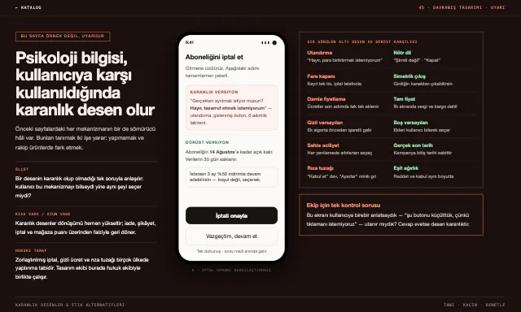

# Tasarım Standartları Kataloğu

**73 tasarım yaklaşımı — her biri hem çalışan canlı örnek, hem de AI kod üretiminde doğrudan kullanılabilir prompt ve kural seti.**

🔗 **Canlı demo:** [design.asveas.com](https://design.asveas.com)



## Bu proje ne?

Klasik stil rehberleri insanlara anlatır; bu katalog aynı anda **makinelere de** anlatır. Her sayfa üç şeyi birden yapar:

1. **Canlı örnek** — stil, o stilin kendi diliyle kurulmuş gerçek bir sayfa olarak çalışır (statik görsel değil).
2. **Prompt kaynağı** — sayfanın altındaki blokta o stilin detaylı İngilizce üretim promptu, Türkçe brief'i, renk paleti, tipografisi, düzen/hareket kuralları ve **kaçınılacaklar** listesi bulunur; tek tıkla seçilip kopyalanır.
3. **Makine katmanı** — aynı bilgi [`ai/catalog.json`](ai/catalog.json) ve stil başına [`ai/styles/*.md`](ai/styles) dosyalarında yapısal olarak da mevcuttur. Bir LLM'e ya da kod asistanına "07 numaralı stilde bir landing page yap" diyebilmeniz için.

Katalog sayfasının kendisi de bu katmandan beslenir: arama (isim, ekol, anahtar kelime, hatta `#hex` kodu), bölüm filtreleri, palet noktaları ve **karttan tek tıkla prompt kopyalama** doğrudan `ai/catalog.json` üzerinden çalışır. Klavye kısayolları: `/` ara, `Esc` temizle, `↵` ilk sonucu aç, 🎲 rastgele stil. Arayüz **Türkçe/İngilizce** (sağ üstten EN/TR).

## Keşfet

- 🖼 **[Galeri — Aynı uygulama, 73 stil](https://design.asveas.com/Galeri.dc.html)** · aynı yapılacaklar listesi, 73 tasarım dilinde. Favorinizi alıntılayıp paylaşın.
- 🎨 **[Test — Hangi tasarım stili sensin?](https://design.asveas.com/Test.dc.html)** · 6 soru, 73 stilden biri sizsiniz; sonucu tek linkle paylaşın.
- 🎛 **[Mikser — İki stili karıştır](https://design.asveas.com/Mikser.dc.html)** · biri görsel dil, biri iskelet: 5.256 harman, tek AI promptu (`?mix=67+57`).
- 🔌 **[MCP sunucusu](mcp/)** · 73 stili Claude Code / Cursor'a araç olarak bağlar: `stil_ara`, `stil_getir`, `stil_listele`.

## İçerik — 15 bölüm, 73 sayfa

| Bölüm | Sayfalar | Kapsam |
|---|---|---|
| 01 · Küratörsel ekoller | 01–06 | Editoryal minimalizm, akışkan ajans, cyber-WebGL, anti-design, endüstriyel, grunge |
| 02 · SaaS akımları | 07–10 | Karanlık SaaS (Linear/Vercel), Bento grid, neo-brütalizm, B2B iskeletizm (Stripe) |
| 03 · Tarihsel akımlar | 11–14 | Bauhaus, İsviçre ızgarası, Y2K, retro terminal |
| 04 · Dokusal trendler | 15–17 | Glassmorphism, neomorphism, claymorphism |
| 05 · Sanat akımları | 18–23 | Art Nouveau, Art Deco, De Stijl, konstruktivizm, Memphis, mid-century |
| 06 · Kültürel diller | 24–27 | Vaporwave, Japon Ma / wabi-sabi, çini geometrik motif, solarpunk |
| 07 · Arayüz dönemleri | 28–30, 73 | Skeuomorfizm, flat design, maksimalizm, saf minimalizm |
| 08 · İlke temelli | 31–33 | Erişilebilirlik öncelikli, kamu hizmeti sade dili, ham HTML brütalizmi |
| 09 · Mobil yapılar | 34–39 | Başparmak bölgesi, swipe destesi, aşamalı açığa çıkarma, boş durumlar, alt sayfalar, sonsuz akış |
| 10 · Davranış & psikoloji | 40–45 | Alışkanlık döngüsü, oyunlaştırma, sosyal kanıt, çapa fiyatlama, zirve–son kuralı, **karanlık desenler (etik uyarı)** |
| 11 · Masaüstü uygulama dilleri | 46–49 | macOS (Ive), Fluent/Windows 11, araç-merkezli editör (Rasmus Andersson), komut paleti |
| 12 · Web uygulama standartları | 50–53 | Blok editör (Ivan Zhao), pazaryeri (Karri Saarinen), medya akışı, IBM Carbon |
| 13 · Mobil uygulama standartları | 54–57 | iOS HIG, Material You (Duarte), jest & fizik (Mike Matas), neo-fintech |
| 14 · Dashboard & yönetim panelleri | 58–61 | Tufte veri-mürekkep, gözlemlenebilirlik, ticaret terminali, Shopify Polaris |
| 15 · Ressamlar arayüz tasarlasaydı | 62–72 | Da Vinci, Monet, Van Gogh, Picasso, Dalí, Hokusai, Klimt, Frida Kahlo, Kandinsky, Rembrandt ve **Osman Hamdi Bey (Kaplumbağa Terbiyecisi)** — her usta bir uygulama tasarlasaydı |

> **Not:** 34–45 arası sayfalar görsel stil değil, **UX / davranış desenidir** — 01–33 arası bir görsel stille birleştirilerek kullanılır. 45 numaralı sayfa bir örnek değil, uyarıdır: karanlık desenleri tanımayı ve dürüst karşılıklarını öğretir.

## AI ile kullanım

```
ai/
├── catalog.json     # 73 stilin tamamı: prompt_en, brief_tr, palette,
│                    # typography, layout, motion, avoid, keywords, section
└── styles/          # stil başına frontmatter'lı markdown (tek stil = tek bağlam)
    ├── 01-editorial-minimalizm.md
    └── …
```

Örnek akış (Claude Code, Cursor vb.):

1. `catalog.json` içinden `title` / `keywords` alanlarıyla stil seçin.
2. İlgili `ai/styles/NN-slug.md` dosyasını bağlama verin — `prompt_en` üretim promptunun çekirdeğidir, `palette`/`typography`/`layout` somut değer kaynağıdır, `avoid` negatif kısıttır.
3. Sonucu `NN-….dc.html` canlı örneğiyle karşılaştırın.

Bu depo kök dizininde bir [`CLAUDE.md`](CLAUDE.md) de içerir; Claude Code bu klasörde açıldığında katalog kurallarını otomatik yükler.

## Nasıl çalışıyor?

Sayfalar `*.dc.html` formatındadır: `<x-dc>` içindeki şablonu [`support.js`](support.js) (dc-runtime) React ile render eder. Şablon dili `{{ prop }}` interpolasyonu, `sc-if`/`sc-for`, `<helmet>` ve `style-hover="…"` gibi pseudo-class öznitelikleri destekler. Katalog sayfası, örnekleri `iframe + scale(.25)` ile canlı küçük önizleme olarak gösterir.

Yerelde çalıştırmak için herhangi bir statik sunucu yeter:

```bash
python3 -m http.server 8000
# → http://localhost:8000/Katalog.dc.html
```

`ai/` katmanını kaynaktan yeniden üretmek için:

```bash
python3 tools/extract_prompts.py
```

## Katkı

Yeni bir stil eklemek üç adımdır:

1. `NN-stil-adi.dc.html` sayfasını yazın (sonunda prompt bloğu zorunlu).
2. [`data/catalog-meta.json`](data/catalog-meta.json) dosyasına kaydı ekleyin (isim, ekol, açıklama, anahtar kelimeler, bölüm).
3. `python3 tools/extract_prompts.py` çalıştırın — `ai/` katmanı ve dolayısıyla Katalog sayfası otomatik güncellenir.
4. Paylaşım kartı için yerel sunucu açıkken `node tools/og_shots.js NN-slug` ve ardından `python3 tools/inject_og.py` çalıştırın. Galeri'ye de bir hücre ekleyin (`Galeri.dc.html`).

Kurallar: sayfa dili Türkçe, tüm stiller inline, görseller yer tutucu (telifli materyal yok).

## Lisans

[MIT](LICENSE) — prompt'lar, sayfalar ve araçlar dahil. Dilediğiniz projede kullanın; atıf sevindirir, şart değildir.
